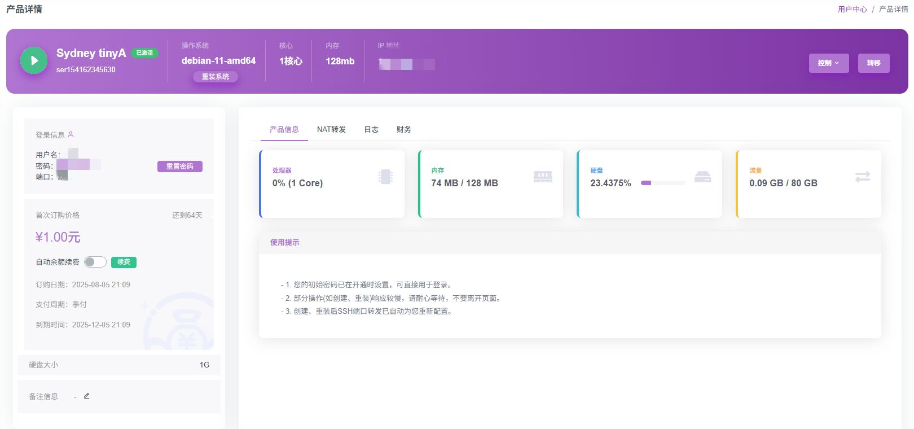
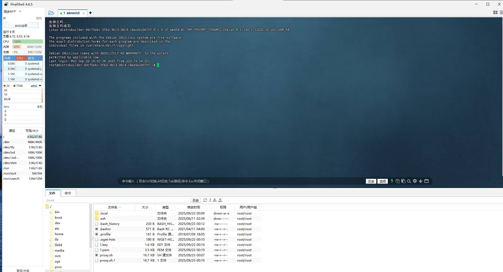
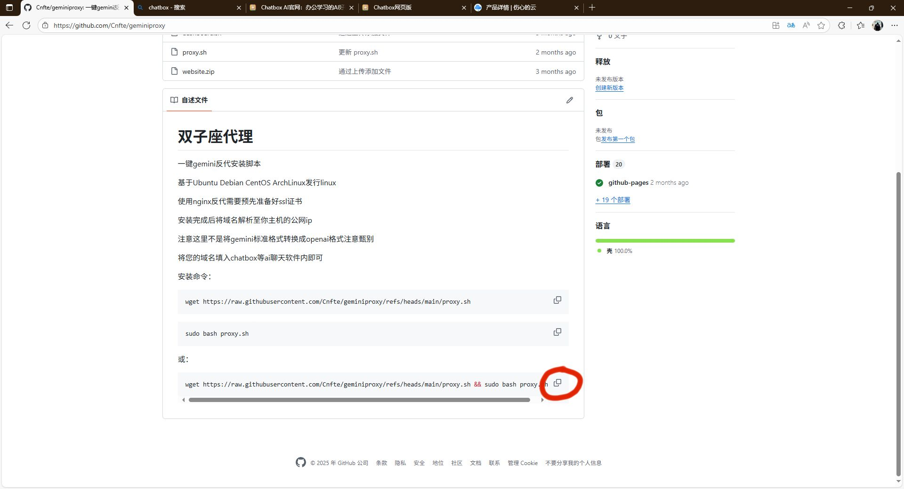
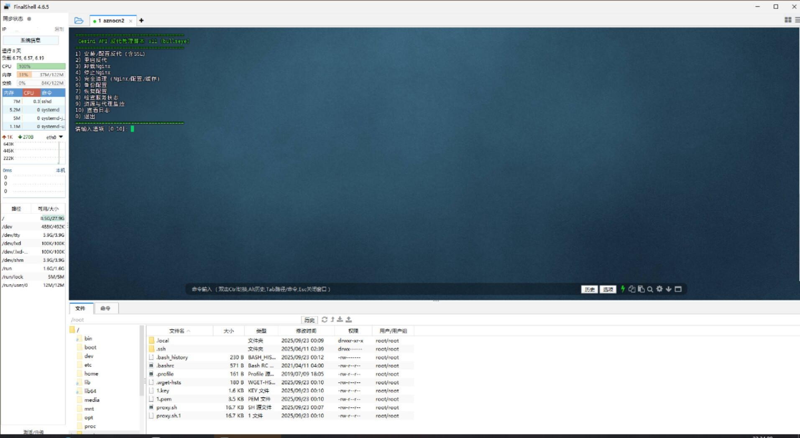
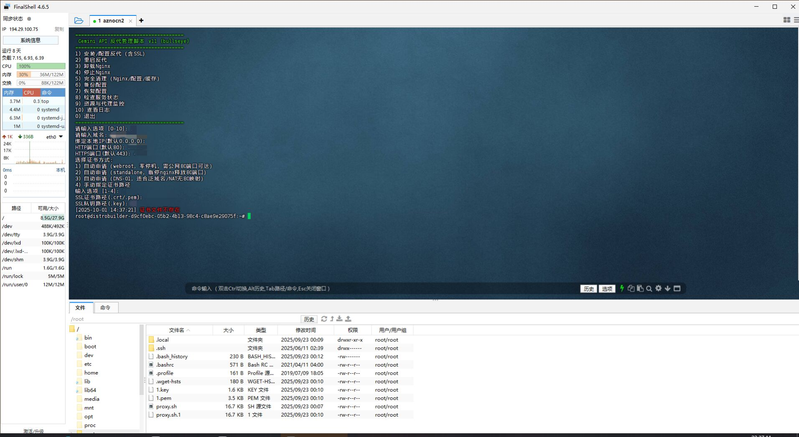
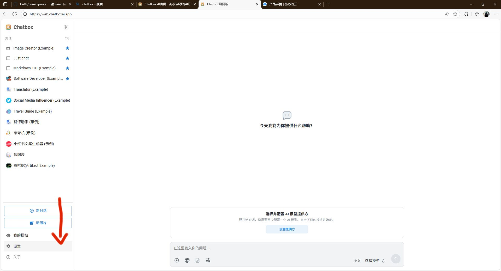
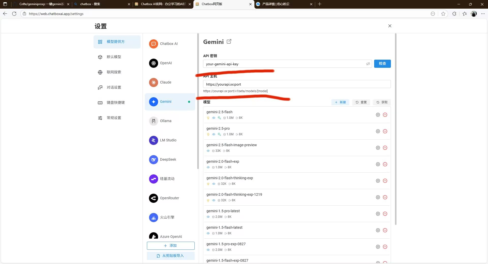

# geminiproxy ✨
**一键部署Gemini反向代理，助力国内用户流畅访问。**

### 功能概述
*   **简便部署：** 单一命令即可在Linux服务器上完成Gemini反向代理的搭建。
*   **广泛兼容：** 支持Ubuntu、Debian、CentOS及ArchLinux等主流Linux发行版。
*   **网络优化：** 有效解决访问Gemini时可能遇到的网络连接问题。

### 重要提示 💡
*   若选择Nginx作为反向代理服务器，请**务必提前准备好SSL证书**。
*   安装完成后，请确保您的**域名已正确解析至服务器的公网IP地址**。
*   **请注意：** 本脚本仅提供Gemini的反向代理功能，**不负责**将Gemini的API格式转换为OpenAI格式。
*   配置完成后，您可以在Chatbox等AI聊天软件中填入您的域名，以便与Gemini进行通信。

---

## 🛠️ 安装指南

### 1. 服务器准备 💻
支持具备公网IP的独立服务器或NAT服务器，前提是能够正常访问互联网。

### 2. 服务器登录 🔑
请获取您的服务器的登录凭证（通常为`root`用户及密码）。
**提示：** 请确认您的服务器已启动并可正常访问。
使用您偏好的SSH客户端（如Xshell、FinalShell）连接至服务器。


*图1：确认登录凭证及服务器运行状态*


*图2：通过SSH客户端连接服务器*

### 3. 执行安装 🚀
请执行以下步骤完成安装：

*   **复制部署命令：**
    
    *图3：复制部署命令*

*   **粘贴至服务器终端并执行：**
    
    *图4：在终端粘贴命令并执行*

*   在出现的管理界面中，输入数字 **1** 选择 **安装反代**。
*   脚本将引导您输入必要信息，包括您的**域名**、**映射端口**以及**SSL证书获取方式**（**NAT服务器用户请务必选择第4种SSL证书获取方式**）。
    
    *图5：按提示输入域名、端口及SSL配置*

*   （演示已完成安装，此处省略重复操作。）
*   安装完成后，请将您的域名解析至服务器公网IP（NAT服务器用户请同时配置端口映射）。

### 4. 开始使用 🎉
安装成功后，即可开始使用Gemini代理。

*   打开您常用的AI聊天客户端，例如Chatbox的App版或Web版。
    
    *图6：启动Chatbox应用或网页版*

*   进入设置界面。
    
    *图7：访问Chatbox设置选项*

*   在设置中填入您的代理域名以及Gemini API Key（**API Key需自行通过ai.dev官网获取**）。
*   配置完成后，即可通过代理与Gemini进行流畅交流。

---

## 💡 优化建议与注意事项

*   为获得更佳的网络延迟体验，建议选择**马来西亚、韩国、日本**等亚洲地区，或欧洲的服务器。

---

## 🚀 安装命令（任选其一）

以下提供三种安装方式，请根据您的需求选择：

**方法一：下载脚本后手动执行（适合需要查看执行细节的用户）**

```shell
wget https://raw.githubusercontent.com/Cnfte/geminiproxy/refs/heads/main/proxy.sh
```
```shell
sudo bash proxy.sh
```

**方法二：下载并立即执行脚本（快速部署）**
```shell
wget https://raw.githubusercontent.com/Cnfte/geminiproxy/refs/heads/main/proxy.sh && sudo bash proxy.sh
```

**方法三：下载、执行并自动删除脚本（用完即清理）**
```shell
wget https://raw.githubusercontent.com/Cnfte/geminiproxy/refs/heads/main/proxy.sh && sudo bash proxy.sh && rm proxy.sh
```
